# MeTube

Plataforma de vídeo full-stack construída do zero, com **upload resumível, processamento assíncrono, streaming adaptativo e pipeline de IA** para transcrição, geração de metadados e sumarização.

[](https://github.com/MatheusZuchiBalbinot/metube/actions/workflows/backend-tests.yml)
[](https://github.com/MatheusZuchiBalbinot/metube/actions/workflows/frontend-test.yml)
[](https://github.com/MatheusZuchiBalbinot/metube/actions/workflows/backend-quality.yml)
[](https://github.com/MatheusZuchiBalbinot/metube/actions/workflows/security-scan.yml)

---

## Showcase

<table>
<tr>
<td width="10%">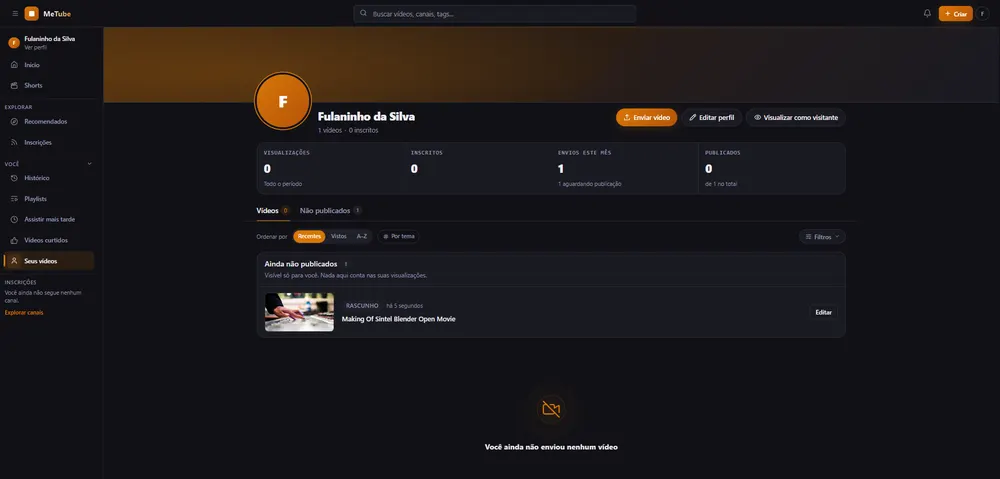</td>
<td width="10%">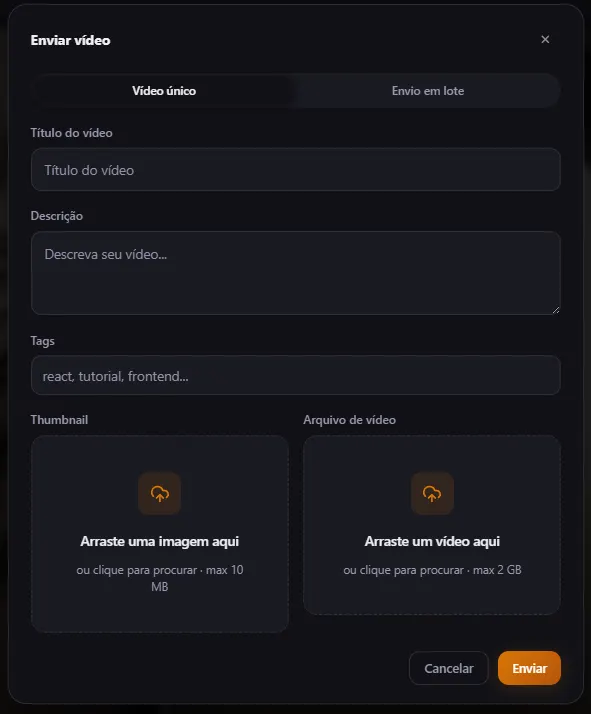</td>
<td width="10%">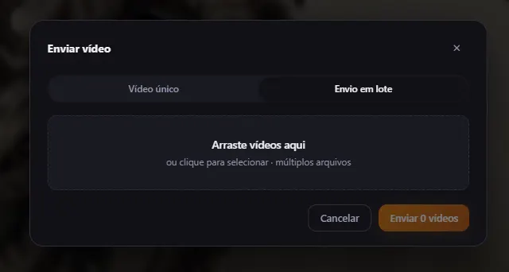</td>
<td width="10%">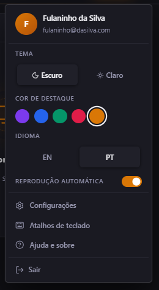</td>
<td width="10%">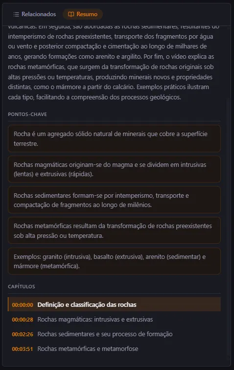</td>
<td width="10%">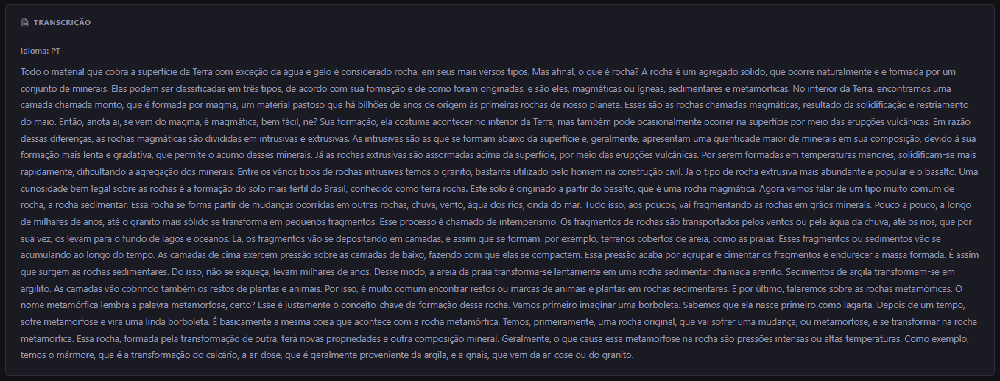</td>
<td width="10%">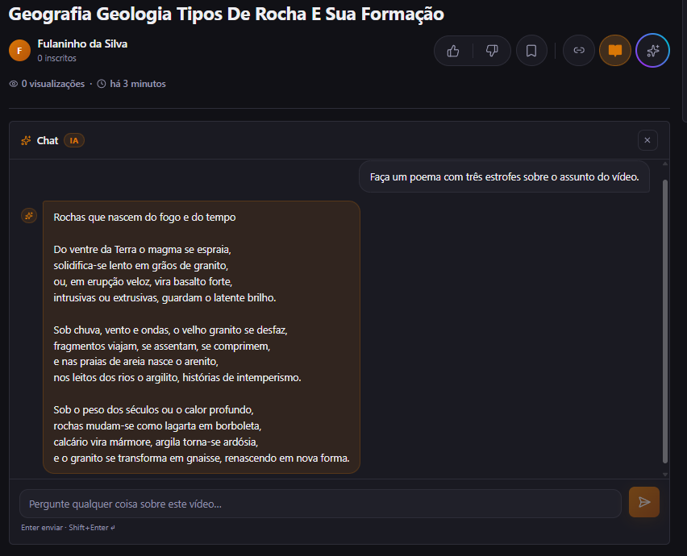</td>
<td width="10%">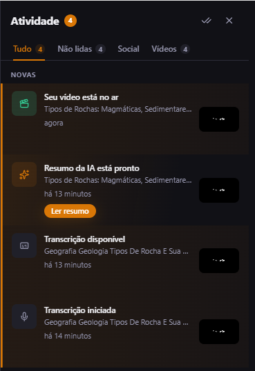</td>
<td width="10%">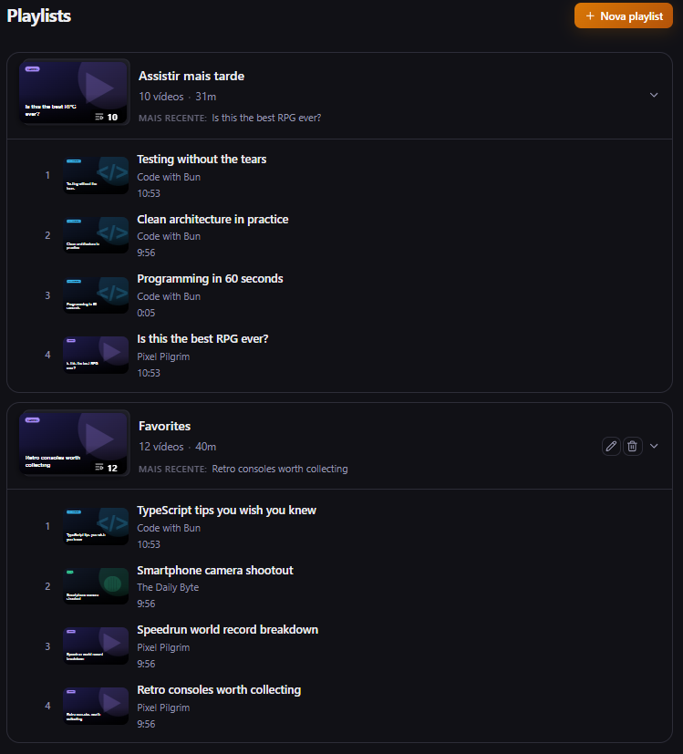</td>
<td width="10%">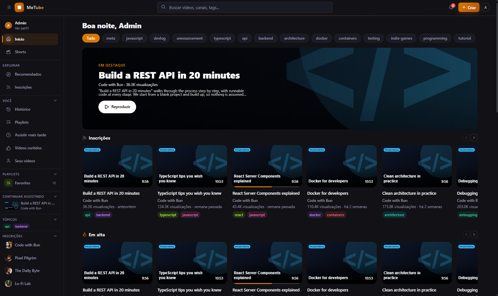</td>
</tr>
</table>

🎥 [Assista a um walkthrough em vídeo](https://youtu.be/fO4vvs1ZJTo) da aplicação rodando.

---

## Funcionalidades

* Upload de vídeos com retomada automática via **tus**, continuando do último offset confirmado
* Processamento assíncrono com **Laravel Horizon** e feedback em tempo real via WebSocket
* Transcrição automática com **faster-whisper / Whisper ASR**
* **Chat com IA sobre o vídeo**, utilizando a transcrição como contexto
* Geração de títulos, descrições, tags e resumos via **LLM**
* Capítulos com timestamp e modo leitura
* **Tradução automática de legendas** via Whisper Translate
* **Agendamento de publicação** de vídeos
* Streaming adaptativo **HLS com múltiplas renditions**, respeitando a resolução da fonte
* Legendas e Picture-in-Picture
* Feed de Shorts com scroll vertical e volume persistente
* Likes, dislikes, saves, inscrições, playlists e histórico
* Recomendações server-side com scoring por afinidade de tags, comportamento, popularidade e frescor
* Full-text search com PostgreSQL `tsvector` + índice **GIN**
* Notificações em tempo real
* Analytics com **event batching** e **bulk inserts** assíncronos
* Persistência e retomada de progresso de reprodução
* Cross-tab synchronization via `storage events`
* **i18n bilíngue (PT/EN)** via `react-i18next`
* Temas e cores de acento persistidos por usuário
* Acessibilidade e navegação completa por teclado

---

## Arquitetura

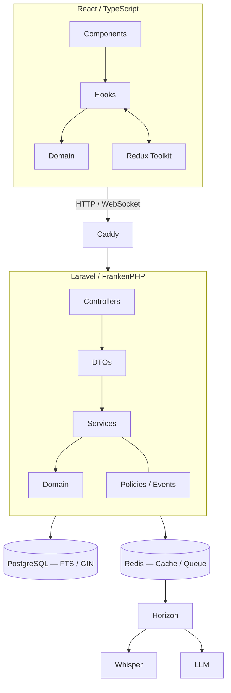

---

## Backend

* **MVC + Service Layer**, com controllers thin e regras de negócio isoladas em services
* **Dependency Injection** para composição de dependências
* **DTOs tipados** entre camada HTTP e aplicação
* **Policy-based Authorization** para ownership e permissões
* **Domain Events / Subscribers** para side effects desacoplados
* **Observers** para invalidação de cache
* Filas priorizadas com **Laravel Horizon**
* **Session versioning** para invalidação global de sessões
* PostgreSQL Full-Text Search com `tsvector` + **GIN**
* **Rate limiting por domínio**, com janelas independentes para autenticação, recuperação de senha, verificação de email e chat com IA
* **OpenTelemetry** com auto-instrumentação de Laravel/PDO e exportação via OTLP
* PHPStan nível 8 + Pint + PHP Insights (**gate de 99%**)

Detalhes de rotas, services e convenções: [`backend/CLAUDE.backend.md`](backend/CLAUDE.backend.md).

---

## Frontend

* Arquitetura orientada a **hooks**, separando UI, estado e lógica de domínio
* **Domain Layer** puro em `src/domain/`, independente de React
* Redux Toolkit com **selectors memoizados**
* **Branded types** (`VideoId`, `Vuid`, `Puid`) para type safety em compile time
* `ApiResult<T>` como contrato uniforme de API
* Player modularizado em hooks especializados
* **Code splitting**, lazy loading e virtualização de listas via `@tanstack/react-virtual`
* Throttle local de 3s + sync de 5s com o backend para progresso de reprodução
* **i18n** com `react-i18next`
* Acessibilidade com ARIA e focus management
* ESLint com complexidade ciclomática máxima de 8 e `no-explicit-any` como erro

Detalhes de aliases, convenções e testes: [`frontend/CLAUDE.frontend.md`](frontend/CLAUDE.frontend.md).

---

## Testes

|               |                   Backend · Pest |        Frontend · Vitest |
| ------------- | -------------------------------: | -----------------------: |
| **Testes**    |                              930 |                    1.696 |
| **Arquivos**  |                                — |                      185 |
| **Cobertura** | Services, Models e Jobs críticos | Domain 100% · Store ~92% |

---

## Stack

| Área          | Tecnologia                                   |
| ------------- | -------------------------------------------- |
| Frontend      | React 19 · TypeScript · Vite / Rolldown      |
| State         | Redux Toolkit                                |
| i18n          | react-i18next                                |
| CSS           | Tailwind CSS 4                               |
| Backend       | Laravel 12 · FrankenPHP / Octane · PHP 8.2+  |
| Database      | PostgreSQL 16                                |
| Cache / Queue | Redis 7                                      |
| Jobs          | Laravel Horizon                              |
| Realtime      | Laravel Reverb · self-hosted                 |
| Upload        | tus · tus-php + tus-js-client                |
| ASR           | faster-whisper · self-hosted                 |
| LLM           | Groq · interface agnóstica de provider       |
| Auth          | Laravel Sanctum · stateful / HttpOnly cookie |
| Proxy         | Caddy 2                                      |
| Observability | OpenTelemetry · OTLP                         |
| Infra         | Docker Compose                               |

---

## Decisões técnicas

* **tus** em vez de multipart upload — uploads grandes sobrevivem a quedas de conexão sem reiniciar
* **Sanctum stateful** em vez de JWT — SPA first-party servida pelo mesmo domínio, com autenticação baseada em cookie
* **Reverb self-hosted** em vez de Pusher — reduz dependência externa no fluxo realtime
* **Recommendation scoring server-side** — mantém dados comportamentais e lógica de ranking fora do cliente
* **PostgreSQL FTS** em vez de search engine dedicado — `tsvector` + GIN atende ao workload atual
* **Redis compartilhado** entre cache e filas — reduz infraestrutura enquanto o volume não justifica separação

---

## 🔭 Evolução

A arquitetura atual prioriza simplicidade operacional. Em uma escala maior:

| Atual                        | Possível evolução                |
| ---------------------------- | -------------------------------- |
| Sanctum / sessão stateful    | OAuth 2.0 / OIDC                 |
| Whisper self-hosted          | ASR gerenciado / GPU workers     |
| LLM via Groq                 | AI Gateway / múltiplos providers |
| Filesystem local             | Object Storage                   |
| Mídia servida pela aplicação | CDN                              |
| Analytics em PostgreSQL      | Event streaming / Data Warehouse |
| PostgreSQL FTS               | Search engine dedicado           |
| Redis compartilhado          | Cache / filas separados          |
| Monólito modular             | Extração seletiva de serviços    |

> A ideia é escalar os componentes conforme os gargalos aparecem, sem introduzir complexidade distribuída prematuramente.

---

## Como rodar

### Pré-requisitos

* Docker + Docker Compose
* Node.js
* PHP + Composer para executar testes e lint localmente

```bash
npm run start
```

`npm run start` cria os `.env` a partir dos `.example` automaticamente se ainda não
existirem (`scripts/bootstrap-env.sh`), e o primeiro boot do backend executa as migrations
sozinho.

Para subir já com conteúdo de demonstração (~50 vídeos, canais, comentários e playlists),
defina `SEED_DEMO_CONTENT=true` em `backend/.env` antes de rodar — o seeder é idempotente,
então fica seguro deixar ligado entre reinícios.

### IA

Para o pipeline completo, configure uma API key compatível com o provider selecionado:

```env
AI_API_KEY=
```

Sem a chave, upload, processamento de vídeo, transcrição e player continuam disponíveis; apenas geração de metadados, resumos e chat com IA ficam indisponíveis.

A transcrição utiliza **faster-whisper em CPU** por padrão. O modelo é baixado no primeiro build do serviço `whisper`.

Também é possível utilizar um serviço externo de ASR configurando `WHISPER_URL` e desabilitando o profile local do Whisper.

### Observability (opcional)

O backend possui auto-instrumentação OpenTelemetry para Laravel e PDO. O export fica desativado por padrão.

Para habilitar, configure em `backend/.env`:

```env
OTEL_EXPORTER_OTLP_ENDPOINT=
OTEL_EXPORTER_OTLP_HEADERS=
```

### Acesso

```text
http://localhost        # Caddy
http://localhost:5173   # Vite + HMR
```

### Parar

```bash
npm run stop
```

---

## CI

GitHub Actions com **path filtering** para executar apenas workflows afetados pelas alterações:

| Workflow                | Responsabilidade                                     |
| ----------------------- | ---------------------------------------------------- |
| `frontend.yml`          | TypeScript + ESLint                                  |
| `frontend-test.yml`     | Vitest                                               |
| `frontend-security.yml` | npm audit                                            |
| `backend-lint.yml`      | PHPStan + Pint                                       |
| `backend-quality.yml`   | PHP Insights · gate de 99%                           |
| `backend-tests.yml`     | Pest · SQLite in-memory                              |
| `whisper.yml`           | Testes do serviço Whisper                            |
| `security-scan.yml`     | Trivy                                                |
| `docs-drift.yml`        | Validação dos caminhos referenciados na documentação |

---

## Estrutura

```text
├── backend/     Laravel 12 — API, Services, Jobs, Events, Observers
├── frontend/    React 19 — SPA, Redux, Player, Shorts, Upload
├── whisper/     faster-whisper — ASR self-hosted
├── caddy/       Reverse Proxy
└── docker-compose.yml
```

Documentação:

* [`frontend/CLAUDE.frontend.md`](frontend/CLAUDE.frontend.md) — aliases, convenções, Redux e testes
* [`backend/CLAUDE.backend.md`](backend/CLAUDE.backend.md) — rotas, services, PHPStan, cache, filas e upload
